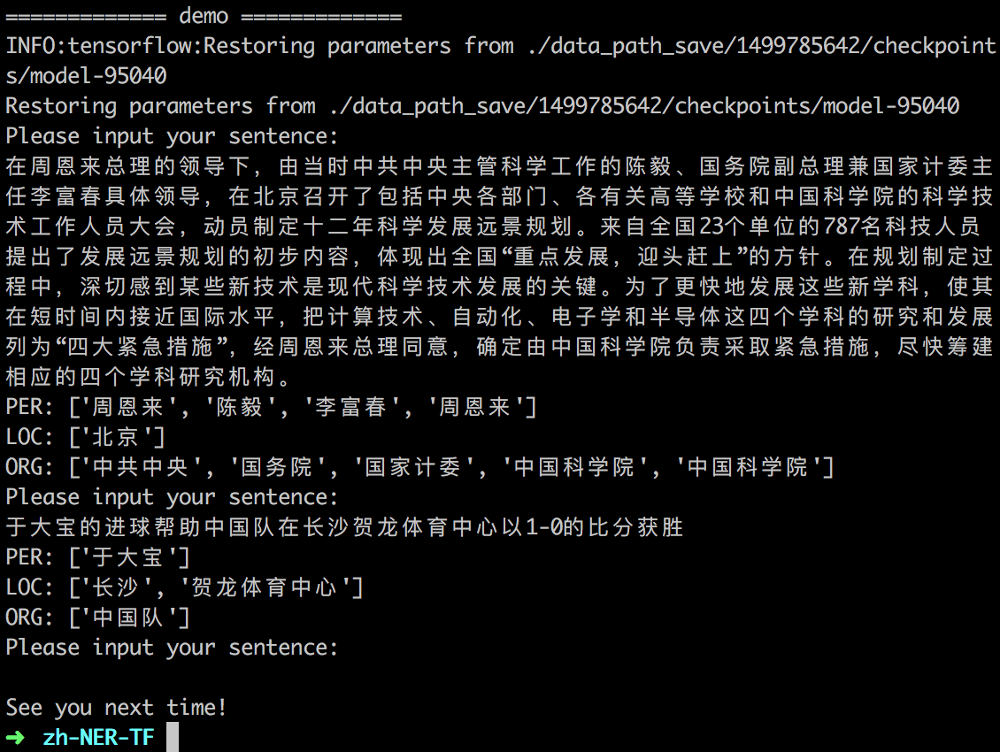

# 

## How to Run

### train

`python main.py --mode=train `

### test

`python main.py --mode=test --demo_model=1521112368`

Please set the parameter `--demo_model` to the model that you want to test. `1521112368` is the model trained by me. 

An official evaluation tool for computing metrics: [here (click 'Instructions')](http://sighan.cs.uchicago.edu/bakeoff2006/)

My test performance:

| P     | R     | F     | F (PER)| F (LOC)| F (ORG)|
| :---: | :---: | :---: | :---: | :---: | :---: |
| 0.8945 | 0.8752 | 0.8847 | 0.8688 | 0.9118 | 0.8515

### demo

`python main.py --mode=demo --demo_model=1521112368`

You can input one Chinese sentence and the model will return the recognition result:

## References

\[1\] [Bidirectional LSTM-CRF Models for Sequence Tagging](https://arxiv.org/pdf/1508.01991v1.pdf)

\[2\] [Neural Architectures for Named Entity Recognition](http://aclweb.org/anthology/N16-1030)

\[3\] [Character-Based LSTM-CRF with Radical-Level Features for Chinese Named Entity Recognition](https://link.springer.com/chapter/10.1007/978-3-319-50496-4_20)

\[4\] [https://github.com/guillaumegenthial/sequence_tagging](https://github.com/guillaumegenthial/sequence_tagging)  